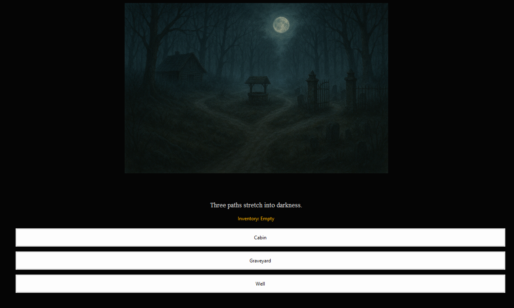

# Adventure of Mind

Adventure of Mind is a psychological horror adventure game built using Python and wxPython.
The game is based on choice-driven storytelling with multiple endings.

## Features
- Choice-based gameplay
- Multiple endings (Escape, Grave, Fake, Bad)
- Inventory-based progression
- Atmospheric horror design

## Requirements
- Python 3.x
- wxPython

## Installation
1. Install Python from https://www.python.org
2. Install wxPython:
   pip install wxPython

## How to Run
Run the following command in the project folder:
python storygame.py

## Gameplay Instructions
- Click buttons to navigate through the story
- Some choices loop back intentionally
- Inventory resets after escape ending

## 📸 Screenshots

### Start Screen

### Crossroads

### Graveyard

## Authors
KUMAR SAMBHAV
KISHAN R
KRISHNA BHOVI
